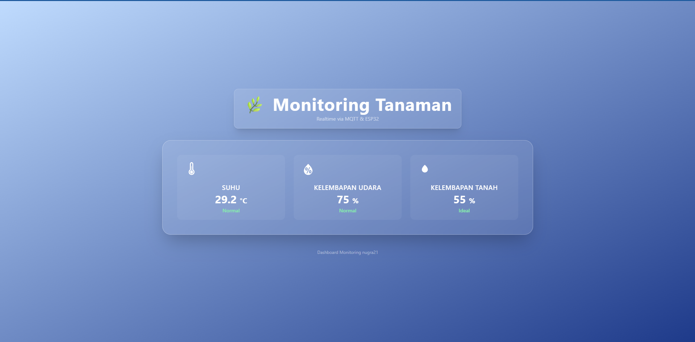

# Monitoring Tanaman - Realtime IoT Dashboard

Website ini merupakan sebuah dashboard realtime yang berfungsi untuk memantau suhu, kelembapan udara, dan kelembapan tanah pada tanaman. Data dikirimkan secara langsung dari perangkat ESP32 melalui protokol MQTT dan ditampilkan secara interaktif melalui antarmuka web. Proyek ini dikembangkan menggunakan React, Tailwind CSS, dan Framer Motion dengan tampilan modern bergaya Glass UI dan gradasi biru.



## Fitur Utama

* Monitoring data sensor secara realtime
* Integrasi langsung dengan broker MQTT publik (HiveMQ)
* Desain UI bertema Glass dan gradasi biru yang responsif
* Penggunaan satu topik MQTT (`data/tanaman`) untuk efisiensi
* Indikator visual untuk kondisi lingkungan (normal, panas, lembap, kering)
* Animasi halus dan interaktif menggunakan Framer Motion

---

## Teknologi yang Digunakan

* React (Frontend Framework)
* Tailwind CSS (Utility-First CSS Framework)
* MQTT.js (MQTT Client untuk WebSocket)
* Framer Motion (Library Animasi untuk React)
* HiveMQ Public Broker (MQTT Broker untuk komunikasi IoT)

---

## Cara Instalasi

1. Clone repository:

   ```bash
   git clone 
   ```

2. Install dependencies:

   ```bash
   npm install
   ```

3. Jalankan proyek:

   ```bash
   npm run dev
   ```

---

## Format Data MQTT

* Topik yang digunakan: `data/tanaman`
* Format pesan JSON:

```json
{
  "suhu": 28.5,
  "kelembapan_udara": 70,
  "kelembapan_tanah": 45
}
```

Pastikan data dikirim dalam format JSON seperti di atas agar dapat dibaca dengan benar oleh dashboard.

---

## Preview Antarmuka

Desain antarmuka mengusung tema gradasi biru dan efek blur transparan (glass effect), dengan animasi transisi yang halus:


---

## Pengembang

Nama: Ludang Prasetyo Nugroho

---

## Lisensi

Proyek ini bersifat open-source dan dapat digunakan secara bebas untuk tujuan pembelajaran atau non-komersial.

---

## Kontak

Untuk informasi lebih lanjut atau kolaborasi:

* Website: [nugra.my.id](https://nugra.my.id)
* Email: [nugra315@gmail.com](mailto:nugra315@gmail.com)
